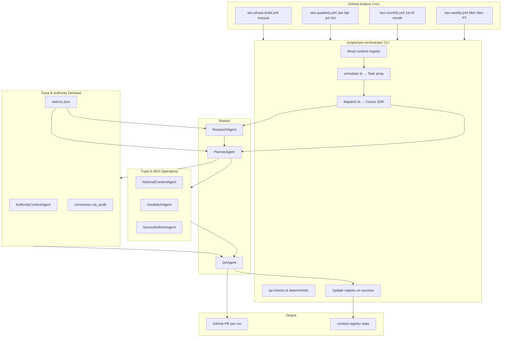

# Agent-Driven SEO Master Plan Automation

**Technical Implementation Plan**

Automate execution of the LCP master SEO + freshness plan using **Cursor SDK (`@cursor/sdk`) + GitHub Actions cron**. Agents produce **PRs only**; a human merges before deploy to Vercel.

**Leadership entry point:** [CEO Alignment Brief](./CEO_ALIGNMENT_BRIEF.md)  
**Program plan:** [Product Implementation Plan](./PRODUCT_IMPLEMENTATION_PLAN.md)  
**Business case:** [CEO Executive Summary](./CEO_EXECUTIVE_SUMMARY.md)  
**Strategic gaps addressed:** [SEO Improvement Plan](./SEO_IMPROVEMENT_PLAN.md) — all five missing layers mapped in [§ Track B](#track-b-authority-and-demand-engine)

**Repo:** [Latestcrazeproductions/LCP_Refresh](https://github.com/Latestcrazeproductions/LCP_Refresh)  
**Default branch:** `main`  
**Production domain:** [latestcrazeproductions.com](https://latestcrazeproductions.com)

---

## Goal

Replace manual spreadsheet scheduling with a git-backed content registry and specialized Cursor cloud agents that refresh national and geo SEO pages on a weekly/monthly/quarterly cadence—without auto-merge.

The program runs on **two tracks:**

- **Track A — SEO Operations:** service pages, geo expansion, freshness, internal linking (demand capture)
- **Track B — Authority & Demand Engine:** case studies, strategy blogs, conversion audits, planning tools, revenue funnel tracking (demand creation + qualified buyers)

Both tracks share the same orchestrator, registry, QA gate, and PR-only deploy model.

**Intelligence (v1):** Semrush is not required. ResearchAgent uses a free stack — Google Search Console, Google Keyword Planner, Google Trends, Bing Webmaster Tools, the SEO page matrix, sales input, and manual competitor review. See [§ Research intelligence stack](#research-intelligence-stack-v1).

---

## Business Alignment Summary

This system is designed to convert LCP's website from a static marketing presence into a **recurring inbound lead-generation engine**. **Track A** captures buyers already searching for event production services. **Track B** builds trust, authority, and conversion paths that help those visitors become qualified opportunities. The system is measured against business outcomes — **leads, opportunities, pipeline, and revenue** — not publishing volume.

---

## Repo discovery (completed)

| Area | Path / detail |
|------|----------------|
| Framework | Next.js 15 App Router (`src/app/`) |
| Static content | `src/content/site-content.ts` — services, about, hero, FAQs |
| CMS | Supabase-backed (`src/app/cms/`, `site_content` table) — see [CMS_SETUP.md](./CMS_SETUP.md) |
| SEO landing matrix | `scripts/generate-seo-page-matrix.mjs` → `public/seo-page-matrix.xml` |
| Sitemap | `src/app/api/sitemap-xml/route.ts`, `src/app/robots.ts` |
| Structured data | `src/lib/structured-data.ts` |
| Geo pages (existing) | e.g. `src/app/phoenix-av-production/page.tsx` |
| Deploy | Vercel — pushes to `main` trigger production |
| Prior SEO analysis | [SEO_ANALYSIS.md](./SEO_ANALYSIS.md) |

**Content directories agents may write to (agreed for v1):**

- `src/app/**/page.tsx` — new geo/service landing pages, case studies, resources/tools
- `src/content/site-content.ts` — national service copy blocks
- `content-library/` — spec blocks, templates, case studies, tools (new)
- `content-registry/` — automation state (new)
- `public/seo-page-matrix.xml` — regenerate via existing script when URLs change

Agents must **not** modify Supabase migrations, env files, or CMS auth without explicit human approval.

---

## Architecture



### Design decisions (locked)

| Decision | Choice |
|----------|--------|
| Runtime | **Cursor SDK cloud agents** (`cloud: { repos, autoCreatePr: true }`) |
| Deploy gate | **PR only** — no auto-merge |
| State | **Git-backed JSON registry** (replaces spreadsheet) |
| Content mix | **55% service / 15% capture blog / 15% strategy blog / 15% authority assets** enforced by task types |
| Keyword layers | National = no city in title; Geo = city required (QA agent enforces) |
| Research cadence | **ResearchAgent monthly** (before content tasks) — gap scan, topic re-rank, briefs |
| Business metrics | `content-registry/metrics.json` — targets vs actuals reported in monthly PRs |

---

## Repo layout (new files)

```
LCP_Refresh/
├── content-registry/
│   ├── config.json                # phase, cadence anchors, flagship domain
│   ├── sites.json                 # 100+ geo site manifests
│   ├── pages.jsonl                # one row per URL: layer, type, keyword, track, lastUpdated, nextAction, tier
│   ├── rotation.json              # current week (1-4), batch A/B site IDs, service rotation index
│   ├── metrics.json               # revenue funnel targets + actuals (Track B)
│   ├── conversion.json            # CTA patterns and page scores (Track B)
│   ├── keywordTAM.json            # head-term targets (Keyword Planner + matrix; refined with GSC)
│   ├── research.json              # gaps, trending topics, competitor notes, last scan
│   ├── competitor-scan.json         # manual SERP review per priority keyword
│   ├── sales-intel.json             # buyer questions and objections from sales team
│   ├── gsc-snapshot/                # committed GSC CSV exports (v1 research input)
│   └── bing-snapshot/               # optional Bing Webmaster Tools exports
├── content-library/
│   ├── specs/                     # locked spec blocks (LED, audio, …) — single source of truth
│   ├── templates/
│   │   ├── service-national.mdx
│   │   ├── service-geo.mdx
│   │   ├── blog-national.mdx
│   │   ├── blog-geo.mdx
│   │   └── case-study.mdx
│   ├── case-studies/
│   │   └── manifest.json          # Night of Hope, Heard Museum, Amazon Fireside, etc.
│   ├── tools/
│   │   ├── manifest.json
│   │   └── templates/             # checklists, timelines, budget worksheets
│   ├── venues/
│   │   └── manifest.json
│   └── topics/
│       ├── national-blog-topics.json
│       ├── geo-blog-topics.json
│       ├── strategy-blog-topics.json   # executive thought leadership (Track B)
│       └── authority-topics.json
│   └── research/
│       └── briefs/                # per-topic briefs (intent, outline, links)
├── agents/
│   ├── prompts/
│   │   ├── research.md
│   │   ├── planner.md
│   │   ├── national-content.md
│   │   ├── geo-batch.md
│   │   ├── service-refresh.md
│   │   ├── authority-content.md      # Track B
│   │   └── qa-gate.md
│   └── rules/
│       └── seo-master-plan.mdc    # distilled rules from master plan for all agents
├── scripts/seo-orchestrator/
│   ├── package.json               # @cursor/sdk dependency
│   ├── src/
│   │   ├── index.ts               # CLI entry: --cadence weekly|monthly|quarterly|phase
│   │   ├── scheduler.ts           # maps cadence + rotation → Task[]
│   │   ├── registry.ts            # read/write pages.jsonl, rotation.json, metrics.json
│   │   ├── demand-math.ts         # funnel gap report from metrics.json (Track B)
│   │   ├── dispatch.ts            # Agent.prompt / Agent.create wrappers
│   │   ├── tasks/                 # task builders per master-plan action
│   │   └── qa-checks.ts           # deterministic pre-PR checks (no LLM)
│   └── tsconfig.json
└── .github/workflows/
    ├── seo-weekly.yml
    ├── seo-monthly.yml
    ├── seo-quarterly.yml
    └── seo-phase-build.yml        # manual: phase 1/2/3 bulk generation
```

---

## Content registry (automation brain)

Replaces the master spreadsheet. **`pages.jsonl`** is the single queue agents work from.

### Example records

```json
{"url":"/services/led-walls","layer":"national","type":"service","keyword":"LED wall event production company","lastUpdated":"2026-06-10","nextAction":"faq_refresh","tier":"monthly","phase":1,"track":"A"}
{"url":"/scottsdale-az/services/led-walls","layer":"geo","siteId":"scottsdale-az","type":"service","keyword":"LED walls Scottsdale","lastUpdated":"2026-05-01","nextAction":"local_proof_line","tier":"monthly","phase":2,"track":"A"}
{"url":"/work/heard-museum-gala","layer":"national","type":"case_study","keyword":"museum gala production","lastUpdated":null,"nextAction":"create","tier":"quarterly","phase":1,"track":"B"}
{"url":"/resources/event-production-checklist","layer":"national","type":"tool","keyword":"event production checklist","lastUpdated":"2026-06-01","nextAction":"content_refresh","tier":"quarterly","phase":1,"track":"B"}
```

### `metrics.json` — revenue funnel (Track B)

```json
{
  "northStar": "Support dedicated inbound sales organization",
  "horizonMonths": 24,
  "targets": {
    "inboundReps": 5,
    "opportunitiesPerRepPerMonth": 20,
    "opportunityToCloseRate": 0.15,
    "leadToOpportunityRate": 0.25,
    "visitToLeadRate": 0.02,
    "monthlyOrganicSessions": 5000,
    "monthlyOrganicLeads": 100,
    "monthlyOrganicOpportunities": 25,
    "monthlyOrganicRevenue": null
  },
  "actuals": {
    "lastUpdated": null,
    "monthlyOrganicSessions": null,
    "monthlyOrganicLeads": null,
    "monthlyOrganicOpportunities": null,
    "monthlyOrganicRevenue": null
  }
}
```

Leadership fills target numbers in Sprint 1. `demand-math.ts` computes required traffic from rep goals and appends a gap report to monthly PRs. v2: GSC API auto-populates `actuals`.

### `conversion.json` — CTA rules (Track B)

```json
{
  "primaryCtaPaths": ["/contact"],
  "requiredPatterns": ["href=\"/contact\"", "Get a Quote", "Request a Consultation"],
  "pageScores": {}
}
```

### `rotation.json` — 4-week cycle

| Week | Track A tasks | Track B tasks |
|------|---------------|---------------|
| 1 | National capture blog OR strategy blog (alternate) + flagship LED refresh + nationwide hub date | `authority.strategy_blog` when not capture week |
| 2 | Geo Batch A (5 sites) + audio refresh | — |
| 3 | National planning blog + lighting + GSC title candidate | `authority.case_study` or `authority.strategy_blog` |
| 4 | Geo Batch B + projection + geo FAQ | `authority.venue_guide` refresh (quarterly) |

Orchestrator computes `dueTasks[]` = pages where `tier` matches cadence AND `lastUpdated` is oldest first.

### `config.json`

```json
{
  "phase": 2,
  "allowNewGeoSites": true,
  "flagshipDomain": "latestcrazeproductions.com"
}
```

### Seeding the registry

1. Run `node scripts/generate-seo-page-matrix.mjs` to produce the URL matrix.
2. Transform matrix rows into `pages.jsonl` with default `tier`, `nextAction`, and `phase`.
3. Merge live sitemap URLs from `/api/sitemap-xml` for pages already indexed.
4. Seed `keywordTAM.json` from Google Keyword Planner + matrix head terms (not Semrush).

---

## Research intelligence stack (v1)

Semrush combines keyword volume, competitor gaps, backlink data, audits, and rank tracking in one paid tool. Without it, those jobs are separated across free sources.

| Source | Role |
|--------|------|
| **Google Search Console** | Primary source of truth — actual queries, impressions, clicks, position, CTR |
| **Google Keyword Planner** | Keyword discovery, rough monthly demand — seeds `keywordTAM.json` |
| **Google Trends** | Seasonality, term comparison, regional interest (directional, not exact volume) |
| **Bing Webmaster Tools** | Secondary keyword ideas, SEO reports, backlink checks |
| **SEO page matrix** | Planned coverage (`pages.jsonl`) |
| **Sales team input** | Buyer questions → `sales-intel.json` |
| **Manual competitor review** | SERP page-type analysis → `competitor-scan.json` |
| **GA4** | Traffic and behavior → `metrics.json` actuals |
| **CRM / forms** | Lead quality and pipeline → `metrics.json` actuals |

Committed snapshots (`gsc-snapshot/`, optional `bing-snapshot/`) are ingested by ResearchAgent in CI. GSC is weak for pre-rank discovery but excellent for telling you what Google is already testing you for.

**Paid SEO tooling (Semrush, Ahrefs, Moz)** may be added when organic visibility and lead activity justify better prioritization — see [TECHNICAL_OVERVIEW.md § When a paid SEO subscription is justified](./TECHNICAL_OVERVIEW.md#when-a-paid-seo-subscription-is-justified).

---

## Agent roles and responsibilities

### 0. ResearchAgent (upstream — monthly + phase builds)

**Runs on:** monthly (first task in monthly cadence), manual `research` cadence, phase-build prep  
**Track:** A + B  
**Does not publish pages** — updates research artifacts and topic queues only.

**Input:** `pages.jsonl`, `keywordTAM.json`, `metrics.json`, `gsc-snapshot/` (v1), `competitor-scan.json`, `sales-intel.json`, optional `bing-snapshot/`, live sitemap, SEO page matrix

**Output:**

- `content-registry/research.json` — prioritized gaps, trending topics, competitor coverage notes
- Re-ranked `content-library/topics/*.json` with `opportunityScore` and `rationale`
- `content-library/research/briefs/{slug}.md` — search intent, recommended angle, H2 outline, internal link targets, cannibalization warnings
- Updates to `competitor-scan.json` when SERP review tasks run
- Proposed `pages.jsonl` additions (new URLs or `nextAction` changes) for human review in PR

**Actions:**

| Task type | What it does |
|-----------|--------------|
| `research.keyword_gap_scan` | Compare GSC + matrix + Keyword Planner vs existing URLs; flag head terms with no page, thin coverage, or impressions without a dedicated landing page |
| `research.trending_topics` | Use Trends + industry signals + sales intel to identify rising topics relevant to LCP services |
| `research.competitor_audit` | Read/update `competitor-scan.json` — page types Google rewards, competitor positioning gaps, differentiated angles |
| `research.topic_brief` | Write a full brief for one queued topic before a content agent is dispatched |

**Manual competitor review (feeds `competitor-scan.json`):**

For each priority keyword, record from top SERP results:

- Page type Google rewards (service page, blog, directory, local page)
- Whether competitors use city pages, case studies, venue guides
- Buyer-question coverage and CTA strength
- Local vs national providers

**Rules:**

- Must not recommend topics that cannibalize existing service head terms (cross-check `pages.jsonl`)
- Geo research must include city-level intent; national research must exclude city names from proposed titles
- Every brief must state primary search intent (informational / commercial / local) and target buyer persona
- Do not use Google Trends as exact search volume — directional only
- v1: GSC/GA4 data committed manually; v2: GSC + GA4 API automation

**Prompt anchor:** `agents/prompts/research.md` + `agents/rules/seo-master-plan.mdc`

PlannerAgent reads `research.json` and attaches `briefPath` to blog, case-study, and strategy tasks.

### 1. PlannerAgent (orchestrator-internal, lightweight)

**Input:** cadence, `rotation.json`, `pages.jsonl`, `metrics.json`, `research.json`, current `config.phase`  
**Output:** ordered `Task[]` JSON (max 5 tasks per run to keep PRs reviewable)

Encodes master-plan rules:

- Phase 1: only national tasks until `/nationwide-event-production` exists
- Phase 2+: geo batches allowed
- Never assign national-head-term blog tasks to geo layer
- Balance Track A and Track B tasks per cadence (monthly always includes at least one Track B task when phase ≥ 1)
- Prefer topics from research queue when `opportunityScore` ≥ threshold; fall back to rotation only when research is stale (> 35 days)

**Track B deterministic tasks:** `seo.internal_links`, `conversion.cta_audit`, `metrics.monthly_review`, `conversion.form_optimize`

### 2. NationalContentAgent

**Runs on:** weekly weeks 1 & 3, quarterly nationwide hub refresh  
**Track:** A (capture blogs) + B (strategy blogs)

**Actions:**

- Draft/publish national blog MDX from `content-library/topics/national-blog-topics.json` (capture mode) **using attached research brief when present**
- Draft/publish strategy blogs from `content-library/topics/strategy-blog-topics.json` (ownership mode — executive topics, not gear specs)
- Update `/nationwide-event-production` case blurb (quarterly)
- Add internal links: blog → service + event page

**Strategy blog rules:** no city in title; must not cannibalize service head terms; min 1,200 words; include business-outcome H2; link to ≥1 service + `/contact`.

**Prompt anchor:** `agents/prompts/national-content.md` + `agents/rules/seo-master-plan.mdc`

### 3. GeoBatchAgent

**Runs on:** weekly weeks 2 & 4, quarterly 10-site deep refresh

**Actions:**

- 1 local blog per site in batch (city in H1)
- 1 local proof line on hub or primary service
- Link each geo site → flagship `/nationwide-event-production`
- Quarterly: replace 1 of 3 geo blogs + refresh local intro/FAQ

**Constraint:** min 35% unique local text vs template (agent instructed; QA verifies)

### 4. ServiceRefreshAgent

**Runs on:** weekly service rotation, monthly FAQ pass  
**Track:** A + B (`conversion.landing_improve`)

**Actions:**

- Swap 1 gallery image + alt text on scheduled service page
- Add 1 FAQ + tweak 1 answer (monthly)
- Set `dateModified` in frontmatter / schema partial
- Propagate spec library changes to geo wrappers only (quarterly)
- Improve hero CTA and quote block on lowest-converting page (monthly, ties to GSC in v2)

### 5. AuthorityContentAgent (Track B — new)

**Runs on:** monthly (case study), quarterly (venue guides, tool pages)

**Actions:**

- Publish case study pages from `content-library/case-studies/manifest.json` → `/work/[slug]` or `/case-studies/[slug]`
- Refresh venue guide pages (extend `/featured-venues`)
- Draft customer stories and conference recaps
- Publish demand-creation tool pages → `/resources/[slug]` (checklists, timelines, planning guides)
- Add structured data (`Article`, `Event` where applicable)
- Internal links: authority asset → relevant service + contact CTA

**Prompt anchor:** `agents/prompts/authority-content.md` + `agents/rules/seo-master-plan.mdc`

### 6. QAAgent (gate before PR)

**Deterministic checks first** (`scripts/seo-orchestrator/src/qa-checks.ts`):

- No duplicate `title` / `h1` across `pages.jsonl`
- National pages: no city names in title (allowlist Phoenix HQ address only in body)
- Geo pages: must include `site.city` in title
- Internal links present (blog → service)
- Min word count on new/changed local sections
- Sitemap includes changed URLs
- **Primary CTA** on every new/changed page: `/contact`, `tel:`, or quote anchor above fold
- **Secondary CTA**: ≥1 related service, case study, or planning resource link
- **Geo pages**: local proof line + market-specific contact CTA
- **Case studies**: min 800 words; client/industry + outcome; ≥1 project image; no unapproved pricing
- **Strategy blogs**: min 1,200 words; business-outcome section required
- **Tool pages**: email-optional download or contact CTA; linked from ≥2 existing pages

**LLM pass (QAAgent cloud prompt):** read diff only; fail PR if cannibalization, thin content, or equipment-brochure tone on strategy blogs detected.

If QA fails → agent revises once → fail workflow with report (no PR).

---

## Mapping master plan → automated tasks

### Track A — SEO Operations

| Master plan cadence | Task type | Agent | Registry tier |
|--------------------|-----------|-------|---------------|
| Weekly national blog (capture) | `blog.national.create` | NationalContentAgent | weekly |
| Weekly geo batch blog + local line | `blog.geo.create`, `geo.local_proof` | GeoBatchAgent | weekly |
| Weekly service image + date | `service.gallery_swap`, `service.date_touch` | ServiceRefreshAgent | weekly |
| Monthly FAQ (2 pages) | `service.faq_refresh` | ServiceRefreshAgent | monthly |
| Monthly GSC title test | `seo.meta_experiment` | NationalContentAgent | monthly |
| Monthly internal links | `seo.internal_links` | PlannerAgent (deterministic script) | monthly |
| Quarterly spec sync | `library.spec_sync` | ServiceRefreshAgent | quarterly |
| Quarterly 10-geo deep refresh | `geo.batch_deep_refresh` | GeoBatchAgent | quarterly |
| Quarterly nationwide hub | `hub.nationwide_refresh` | NationalContentAgent | quarterly |
| Quarterly prune | `seo.noindex_candidates` | qa-checks.ts + human PR note | quarterly |

### Track B — Authority & Demand Engine

Maps [SEO Improvement Plan](./SEO_IMPROVEMENT_PLAN.md) missing layers 1–5.

| Cadence | Task type | Agent | Layer | Registry tier |
|---------|-----------|-------|-------|---------------|
| Monthly | `research.keyword_gap_scan` | ResearchAgent | 0 Intelligence | monthly |
| Monthly | `research.trending_topics` | ResearchAgent | 0 Intelligence | monthly |
| Quarterly | `research.competitor_audit` | ResearchAgent | 0 Intelligence | quarterly |
| Per assign | `research.topic_brief` | ResearchAgent | 0 Intelligence | on-demand |
| Weekly | `authority.strategy_blog` | NationalContentAgent | 4 Topic ownership | weekly |
| Monthly | `authority.case_study` | AuthorityContentAgent | 2 Authority | monthly |
| Monthly | `authority.customer_story` | AuthorityContentAgent | 2 Authority | monthly |
| Monthly | `conversion.cta_audit` | PlannerAgent (deterministic) | 3 Conversion | monthly |
| Monthly | `conversion.landing_improve` | ServiceRefreshAgent | 3 Conversion | monthly |
| Monthly | `metrics.monthly_review` | PlannerAgent + `demand-math.ts` | 1 Revenue model | monthly |
| Quarterly | `authority.venue_guide` | AuthorityContentAgent | 2 Authority | quarterly |
| Quarterly | `authority.conference_recap` | AuthorityContentAgent | 2 Authority | quarterly |
| Quarterly | `demand.tool_page` | AuthorityContentAgent | 5 Demand creation | quarterly |
| Quarterly | `demand.template_publish` | AuthorityContentAgent | 5 Demand creation | quarterly |
| Quarterly | `demand.checklist_refresh` | AuthorityContentAgent | 5 Demand creation | quarterly |
| Quarterly | `conversion.form_optimize` | PlannerAgent + human | 3 Conversion | quarterly |

The 4-week rotation is encoded in `rotation.json`; the orchestrator increments week after each successful weekly run. Max 5 tasks per run across both tracks.

---

## Track B: Authority and Demand Engine

Addresses all five gaps identified in [SEO Improvement Plan](./SEO_IMPROVEMENT_PLAN.md). Track B runs on the same orchestrator and PR gate as Track A.

### Layer 1: Search Demand Math → Revenue Model

- **Registry:** `metrics.json`, `keywordTAM.json` (head terms from [SEO_ANALYSIS.md](./SEO_ANALYSIS.md) baseline + Keyword Planner + GSC)
- **Module:** `demand-math.ts` — work backward from inbound-rep goal to required traffic/leads
- **Task:** `metrics.monthly_review` — refresh actuals, compute funnel gap, flag if publishing outpaces lead growth
- **PR output:** Revenue Model block (targets vs actuals, conversion rates, gap to rep goal)
- **v2:** GSC API auto-populates `actuals`

### Layer 2: Authority → Case studies, venues, recaps

- **Agent:** AuthorityContentAgent
- **Tasks:** `authority.case_study`, `authority.venue_guide`, `authority.customer_story`, `authority.conference_recap`
- **Content:** `content-library/case-studies/manifest.json` — seed Night of Hope, New Pathways, Amazon Fireside Chat, Heard Museum, corporate conferences
- **Routes:** `/work/[slug]`, `/case-studies/[slug]`, extend `/featured-venues`

### Layer 3: Conversion Infrastructure → CTA audits

- **Registry:** `conversion.json`
- **Tasks:** `conversion.cta_audit` (monthly scan), `conversion.landing_improve` (monthly), `conversion.form_optimize` (quarterly, human-in-loop)
- **QA:** every changed page must answer "what should this visitor do next?"
- **Monthly output:** CTA audit table (URL | primary CTA | pass/fail) attached to PR

### Layer 4: Topic Ownership → Strategy blogs

- **Agent:** NationalContentAgent (strategy mode, separate from capture blogs)
- **Task:** `authority.strategy_blog` — alternate with `blog.national.create` on week 1
- **Topics:** `strategy-blog-topics.json` — e.g. attendee engagement, general session design, production ROI, hire vs in-house AV
- **Rules:** executive/planner tone; outcomes not gear specs; anti-cannibalization vs service pages

### Layer 5: Demand Creation → Tools and templates

- **Agent:** AuthorityContentAgent
- **Tasks:** `demand.tool_page`, `demand.template_publish`, `demand.checklist_refresh`
- **Content:** `content-library/tools/` — event budget worksheet, conference timeline, AV checklist, venue selection guide
- **Routes:** `/resources/[slug]` — v1 static MDX + download; v2 lightweight calculators
- **Rules:** no pricing calculators without finance approval; no forced email gate in v1

### Agent roster (both tracks)

| # | Agent | Track | Role |
|---|-------|-------|------|
| 0 | ResearchAgent | A + B | Gap scan, trending topics, competitor audit, topic briefs |
| 1 | PlannerAgent | A + B | Scheduling, internal links, CTA audit, metrics review, form optimize |
| 2 | NationalContentAgent | A + B | Capture blogs + strategy blogs + nationwide hub |
| 3 | GeoBatchAgent | A | Geo batches, local proof, deep refresh |
| 4 | ServiceRefreshAgent | A + B | Service refresh, FAQ, landing improve |
| 5 | AuthorityContentAgent | B | Case studies, venues, tools, demand assets |
| 6 | QAAgent | A + B | Deterministic + LLM gate for all tracks |

---

## Phase automation (build vs operate)

| Phase | Trigger | Agent behavior |
|-------|---------|----------------|
| **1 — National** | Manual `seo-phase-build phase=1` | Generate `/nationwide-event-production`, `/markets`, 6 national blogs, 2 case studies, 2 strategy blogs, 1 tool page (`/resources/event-production-checklist`), schema partials |
| **2 — Pilot 10 geo** | Manual `phase=2 batch=10` | GeoBatchAgent generates 10 × (7 service + 3 blog) from `sites.json` |
| **3 — Scale 100** | Manual `phase=3 batch=100` | Batched PRs (10 sites/PR max) with QA between batches |
| **4 — Operate** | Cron weekly/monthly/quarterly | Refresh-only tasks; block new geo if `pages.jsonl` has stale `tier=quarterly` backlog; Track B tasks on monthly/quarterly cadence |

---

## Orchestrator CLI (`scripts/seo-orchestrator`)

### Entry

```bash
cd scripts/seo-orchestrator
npm ci
npm run seo:run -- --cadence weekly
npm run seo:run -- --cadence weekly --dry-run   # print tasks only, no agents
```

### Flow

1. Load registry + rotation
2. `scheduler.ts` → `Task[]` per master plan
3. For each task, `dispatch.ts` calls Cursor SDK
4. On `result.status === "finished"`, run `qa-checks.ts` against branch
5. Update `pages.jsonl` + advance `rotation.json` week
6. Commit registry updates **on the same PR** (agent instructed to include registry diff)

### SDK dispatch (cloud, PR-only)

Always set `cloud` explicitly—omitting it silently runs a local agent.

```typescript
import { Agent, CursorAgentError } from "@cursor/sdk";

try {
  const result = await Agent.prompt(buildPrompt(task), {
    apiKey: process.env.CURSOR_API_KEY!,
    model: { id: "composer-2.5" },
    cloud: {
      repos: [{
        url: "github.com/Latestcrazeproductions/LCP_Refresh",
        ref: "main",
      }],
      autoCreatePr: true,
      skipReviewerRequest: true,
    },
  });

  if (result.status === "error") {
    process.exit(2); // run started but failed
  }
} catch (err) {
  if (err instanceof CursorAgentError) {
    process.exit(1); // auth/config/network — didn't start
  }
  throw err;
}
```

Use **`Agent.prompt`** for single-task runs; use **`Agent.create` + follow-up sends** only for phase-build bulk (multi-turn).

---

## GitHub Actions workflows

### Secrets required

| Secret | Purpose |
|--------|---------|
| `CURSOR_API_KEY` | Team service account with repo access ([Cursor Dashboard → Integrations](https://cursor.com/dashboard/integrations)) |
| `GITHUB_TOKEN` | Default — PR creation via cloud agent |

Store `CURSOR_API_KEY` in GitHub: **Settings → Secrets and variables → Actions**.

### `seo-weekly.yml`

```yaml
name: SEO Weekly

on:
  schedule:
    - cron: '0 16 * * 1'   # Mon 9am PT (16:00 UTC)
  workflow_dispatch:

jobs:
  run:
    runs-on: ubuntu-latest
    steps:
      - uses: actions/checkout@v4
      - uses: actions/setup-node@v4
        with:
          node-version: '22'
      - run: npm ci && npm run seo:run -- --cadence weekly
        working-directory: scripts/seo-orchestrator
        env:
          CURSOR_API_KEY: ${{ secrets.CURSOR_API_KEY }}
```

### `seo-monthly.yml` — 1st of month

Same structure; `--cadence monthly`. Adds FAQ refresh tasks, GSC title candidate, competitor topic flag, plus Track B: `conversion.cta_audit`, `metrics.monthly_review`, `authority.case_study`, `conversion.landing_improve`.

### `seo-quarterly.yml` — Jan, Apr, Jul, Oct

Same structure; `--cadence quarterly`. Adds spec sync, 10-geo batch deep refresh, sitemap lastmod, noindex candidates, plus Track B: `authority.venue_guide`, `demand.tool_page`, `conversion.form_optimize`.

### `seo-phase-build.yml` — manual

```yaml
on:
  workflow_dispatch:
    inputs:
      phase:
        type: choice
        options: ['1', '2', '3']
      batchSize:
        type: choice
        options: ['10', '50', '100']
```

---

## Human review checklist (PR template)

Auto-generated PR body includes:

- Cadence + rotation week
- Tasks executed (from registry) — Track A and Track B labeled
- QA report (pass/fail items)
- Pages changed + keyword layer (national/geo)
- **Monthly only:** Revenue Model block (targets vs actuals from `metrics.json`)
- **Monthly only:** CTA audit report (when `conversion.cta_audit` ran)

**Reviewer confirms:**

- [ ] Titles follow national/geo ownership rules
- [ ] Local copy is genuinely local (not template swap)
- [ ] No pricing claims without approval
- [ ] Every changed page has a clear next step for the visitor (CTA)
- [ ] Case studies and strategy blogs read as authority content, not equipment brochures
- [ ] Registry diff (`pages.jsonl`, `rotation.json`, `metrics.json`) matches work done
- [ ] `node scripts/generate-seo-page-matrix.mjs` run if URLs added

---

## Implementation sequence

See [BUILD_PLAN.md](./BUILD_PLAN.md) for the execution guide. Checklist below mirrors repo state.

### Sprint 1 — Foundation

- [x] Add `content-registry/`, `content-library/`, intelligence snapshots (`gsc-snapshot/`, `competitor-scan.json`, `sales-intel.json`)
- [x] Seed from `public/seo-page-matrix.xml` via `npm run seed-registry`
- [x] Implement `registry.ts`, `scheduler.ts`, `qa-checks.ts` (deterministic, including CTA + title rules)
- [x] Add `track` field (`A` | `B`) on `pages.jsonl` records
- [x] Blog, `/work/`, `/resources/` routes + sitemap
- [x] `seo-weekly-dry-run.yml` (`--dry-run` prints tasks, no agents)

### Sprint 2 — First agent PR

- [x] `@cursor/sdk` + `dispatch.ts` with explicit `cloud` config
- [x] `ServiceRefreshAgent` prompt (`agents/prompts/service-refresh.md`)
- [x] `seo-weekly.yml` (live; use `--max-tasks 1` until Phase 0 gate 0.8 complete)
- [ ] First agent PR merged (requires `CURSOR_API_KEY` + human review)

### Sprint 3 — Full agent roster + cadence

- [x] ResearchAgent prompt + monthly `research.*` tasks in scheduler
- [x] NationalContentAgent, GeoBatchAgent, AuthorityContentAgent, QAAgent prompts
- [x] PlannerAgent logic in `scheduler.ts` (phase gates, mix, max 5 tasks, research priority)
- [x] `demand-math.ts` + `conversion.cta_audit` (monthly)
- [x] Rotation advancement in registry
- [x] `seo-monthly.yml` + `seo-quarterly.yml`

### Sprint 4 — Phase build + ops

- [x] `seo-phase-build.yml` (manual phase 1/2/3)
- [x] [SEO_OPS_RUNBOOK.md](./SEO_OPS_RUNBOOK.md)
- [x] PR template (`.github/pull_request_template/seo-agent.md`)
- [ ] Phase 1 national build merged (manual trigger + marketing review)
- [ ] Phase 2 ten-city pilot merged

---

## Optional integrations (v2)

| Integration | Purpose |
|-------------|---------|
| **Google Search Console API** | Auto-pick lowest-CTR page for monthly title test |
| **Slack webhook** | PR ready for review notification |
| **Competitor RSS / sitemap diff** | Monthly competitor check → topic suggestion in PR description |

---

## Risks and mitigations

| Risk | Mitigation |
|------|------------|
| Thin duplicate geo pages | QA min-uniqueness + 10-site pilot before 100 |
| Agent hallucinates pricing | Prompt ban + no price fields in templates |
| PR fatigue (too many changes) | Max 5 tasks/run; batch geo generation 10 sites/PR |
| Cannibalization national/local | Deterministic title rules in `qa-checks.ts` |
| API cost at scale | Weekly = 1–2 agent runs; bulk build manual/phase workflow only |
| Wrong SDK runtime | Always pass `cloud: { repos: [...] }` explicitly in CI |
| Traffic without leads | Monthly `metrics.monthly_review` + `conversion.cta_audit`; leadership sets funnel targets in `metrics.json` |

---

## Prerequisites checklist

| Item | Status |
|------|--------|
| LCP repo path | `/Users/lcp/LCP_Refresh` |
| GitHub org/repo | `Latestcrazeproductions/LCP_Refresh` |
| Default branch | `main` |
| `CURSOR_API_KEY` in GitHub Actions secrets | **Required before Sprint 2** |
| Content directory convention | See [Repo discovery](#repo-discovery-completed) |
| GSC property access | **Recommended** — primary v1 intelligence source |
| GA4 property access | Recommended — traffic and conversion actuals |
| Google Keyword Planner access | Recommended — seed `keywordTAM.json` |
| Bing Webmaster Tools (verified site) | Optional — secondary keyword/backlink data |
| Paid SEO subscription (Semrush etc.) | **Not required for v1** |

---

## Related docs

- [CEO_ALIGNMENT_BRIEF.md](./CEO_ALIGNMENT_BRIEF.md) — leadership entry point
- [PRODUCT_IMPLEMENTATION_PLAN.md](./PRODUCT_IMPLEMENTATION_PLAN.md) — program execution plan
- [CEO_EXECUTIVE_SUMMARY.md](./CEO_EXECUTIVE_SUMMARY.md) — leadership business case and success metrics
- [SEO_IMPROVEMENT_PLAN.md](./SEO_IMPROVEMENT_PLAN.md) — strategic gap analysis (all five layers mapped in § Track B)
- [SEO_ANALYSIS.md](./SEO_ANALYSIS.md) — one-time baseline audit (March 2026 Semrush snapshot; historical reference only)
- [CMS_SERVICE_CONTENT.md](./CMS_SERVICE_CONTENT.md) — CMS service fields
- [LASSO_CONTACTS_CRON.md](./LASSO_CONTACTS_CRON.md) — existing cron pattern reference
- [Cursor SDK TypeScript docs](https://cursor.com/docs/sdk/typescript)
