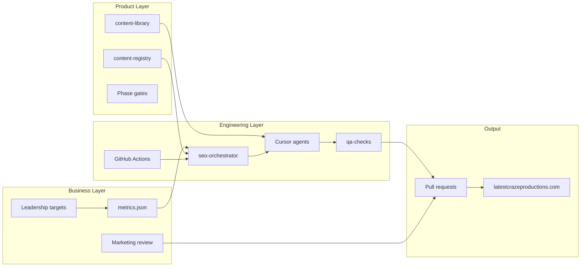

# Product Implementation Plan — AI-Powered Organic Growth

**Program:** Latest Craze Productions Inbound Demand Engine  
**Repo:** [Latestcrazeproductions/LCP_Refresh](https://github.com/Latestcrazeproductions/LCP_Refresh)  
**Production:** [latestcrazeproductions.com](https://latestcrazeproductions.com)  
**Horizon:** 12–24 months  
**Last updated:** June 2026

---

## Document purpose

This is the **master implementation plan** for the organic growth program. It translates business intent into phased deliverables, sprint work, ownership, acceptance criteria, and success metrics.

| Document | Role | Audience |
|----------|------|----------|
| [CEO Alignment Brief](./CEO_ALIGNMENT_BRIEF.md) | First-pass leadership decision doc | Jason / leadership |
| [CEO Executive Summary](./CEO_EXECUTIVE_SUMMARY.md) | Full business narrative | Leadership |
| [Technical Overview](./TECHNICAL_OVERVIEW.md) | What we are building; agent roles and system shape | Engineering, product |
| [Build Plan](./BUILD_PLAN.md) | **Execution guide** — sprints, gates, commands | Engineering |
| **This document** | Program execution plan | Product, marketing, engineering |
| [Agent SEO Automation](./AGENT_SEO_AUTOMATION.md) | Technical implementation spec | Engineering |
| [SEO Improvement Plan](./SEO_IMPROVEMENT_PLAN.md) | Strategic gap analysis (resolved) | Internal reference |
| [SEO Analysis](./SEO_ANALYSIS.md) | Baseline audit | All |

---

## Business alignment summary

Latest Craze Productions will convert its website from a **static marketing presence** into a **recurring inbound lead-generation engine**.

The program runs on two complementary tracks:

| Track | Purpose | Buyer impact |
|-------|---------|--------------|
| **Track A — Demand Capture** | Rank for high-intent service searches; expand geo coverage; maintain freshness | Captures buyers already searching for production partners |
| **Track B — Authority & Demand** | Case studies, strategy content, conversion paths, planning tools, funnel metrics | Builds trust and converts visitors into qualified opportunities |

**North star:** Enough qualified inbound opportunities to support a dedicated inbound sales organization.

**Measurement principle:** Success is measured by leads, opportunities, pipeline, and revenue — **not** publishing volume.

---

## Current state (baseline)

| Area | Today | Target |
|------|-------|--------|
| Organic queries with impressions (GSC) | 0 | 50+ target queries; geo coverage in priority markets |
| Organic traffic | ~0 | Measurable growth month-over-month |
| Indexable routes | ~15 | 100+ phased (national + geo + authority) |
| Geo landing pages | 1 (`phoenix-av-production`) | 10 pilot → 100 scale |
| Blog / case study routes | None | National + geo blogs; case study library |
| Nationwide hub | Not built | `/nationwide-event-production` |
| SEO automation | Spec only | Orchestrator + agents + cron |
| Inbound lead attribution | Informal | `metrics.json` funnel tracking |

**Existing assets to leverage:**

- [scripts/generate-seo-page-matrix.mjs](../scripts/generate-seo-page-matrix.mjs) — 1,110 planned URLs in matrix
- [src/content/site-content.ts](../src/content/site-content.ts) — service copy blocks
- [src/app/featured-venues](../src/app/featured-venues) — venue foundation
- Portfolio work: Night of Hope, Heard Museum, Amazon Fireside Chat, New Pathways, corporate conferences
- Supabase CMS for live service/event content (agents edit git static content in v1)

---

## Scope

### In scope

- Git-backed content registry and content library
- TypeScript SEO orchestrator with Cursor SDK cloud agents
- Track A + Track B automated task cadence (weekly / monthly / quarterly)
- PR-only publishing gate; human review before Vercel deploy
- Phase 1 national foundation → Phase 2 10-city pilot → Phase 3 scale → Phase 4 operate
- Revenue funnel targets and monthly gap reporting
- Case studies, strategy blogs, planning resources, CTA audits
- Blog MDX routes, `/work/[slug]`, `/resources/[slug]`

### Out of scope (v1)

- Auto-merge or auto-deploy without human PR approval
- Supabase migration / CMS auth changes by agents
- Pricing calculators without finance approval
- Forced email gates on downloadable resources
- Paid ads, outbound automation, CRM integration (v2 candidates)
- GSC API auto-population of metrics (v2 — manual CSV OK in v1)

---

## Program architecture

---

## Phased rollout

### Phase 0 — Planning & commit (Week 0)

**Objective:** Align leadership, commit planning artifacts, set funnel targets.

| Deliverable | Owner | Acceptance criteria |
|-------------|-------|---------------------|
| Leadership approves program | CEO / Jason | Written go-ahead on phased rollout |
| Funnel targets in `metrics.json` | Leadership + marketing | `inboundReps`, conversion rates, monthly lead/opp targets set |
| Matrix + docs committed to git | Engineering | `seo-page-matrix.xml`, all `docs/` program files on `main` |
| `CURSOR_API_KEY` in GitHub secrets | Engineering | Secret present before Sprint 2 |

**Exit gate:** Phase 0 complete → Sprint 1 may begin.

---

### Phase 1 — National Foundation (Weeks 1–8)

**Objective:** Core national content live; automation foundation running in dry-run; first authority assets published.

**Trigger:** Manual `seo-phase-build phase=1`

#### Content deliverables

| Asset | Route | Track | Qty |
|-------|-------|-------|-----|
| Nationwide event production hub | `/nationwide-event-production` | A | 1 |
| Markets index | `/markets` | A | 1 |
| National service pages (matrix tier 1–2) | `/services/*`, dedicated landings | A | 6+ |
| National capture blogs | `/blog/[slug]` | A | 4 |
| Strategy blogs | `/blog/[slug]` | B | 2 |
| Case studies | `/work/[slug]` | B | 2 (Night of Hope, Heard Museum or equivalent) |
| Planning resource | `/resources/event-production-checklist` | B | 1 |
| Schema partials | sitewide | A | Organization, Service, FAQ on new pages |

#### Engineering deliverables

| Deliverable | Sprint | Acceptance criteria |
|-------------|--------|---------------------|
| `content-registry/` seeded | 1 | `pages.jsonl` has live + planned rows with `track` field |
| `content-library/` seeded | 1 | Specs, topics, case-study manifest, tools manifest |
| Orchestrator dry-run | 1 | `--dry-run` prints correct weekly tasks for rotation week 1 |
| `qa-checks.ts` deterministic | 1 | CTA, title, cannibalization rules pass on sample pages |
| Blog + work + resources routes | 1 | Routes render; URLs in sitemap |
| First agent PR (ServiceRefresh) | 2 | One national service FAQ + date touch merged |
| `seo-weekly.yml` live | 2 | Workflow runs; opens PR (not dry-run) |

#### Success metrics (Phase 1)

| Metric | Target (end of Phase 1) |
|--------|-------------------------|
| National pages indexed | ≥ 15 new URLs in sitemap |
| Authority assets live | ≥ 2 case studies + 1 resource |
| Automation | Weekly dry-run green; ≥ 1 successful agent PR merged |
| Rankings | First national keywords appearing in GSC (impressions > 0) |

**Exit gate:** `/nationwide-event-production` live in registry as `implementationStatus: live`; Phase 2 geo tasks unlocked in scheduler.

---

### Phase 2 — Geographic Expansion Pilot (Weeks 9–16)

**Objective:** Prove geo model on 10 cities before scaling to 100.

**Trigger:** Manual `seo-phase-build phase=2 batch=10`

#### Content deliverables (per city × 10)

| Asset | Qty per city |
|-------|--------------|
| Geo hub or primary service landing | 1 |
| Service wrapper pages | 7 |
| Local blogs | 3 |
| Local proof line on hub | 1 |
| Link to nationwide hub | 1 |

**Pilot market selection criteria:**

- Mix of Tier A (high intent) and Tier B markets from matrix
- Must include at least 2 non-Arizona cities
- Seed in `content-registry/sites.json` with `city`, `state`, `slug`, `batch` (A or B)

#### Engineering deliverables

| Deliverable | Sprint | Acceptance criteria |
|-------------|--------|---------------------|
| GeoBatchAgent prompts | 3 | 10-city batch PR with ≥ 35% unique local text per site |
| AuthorityContentAgent pilot | 3 | 1 case study PR merged |
| Monthly workflow | 3 | `seo-monthly.yml` runs CTA audit + metrics review |
| Quarterly workflow | 3 | `seo-quarterly.yml` dry-run or first run |
| `config.allowNewGeoSites: true` | 2 | Set after Phase 1 gate passed |

#### Success metrics (Phase 2)

| Metric | Target |
|--------|--------|
| Geo pages indexed | 10 cities × ~11 pages = ~110 URLs |
| QA pass rate | ≥ 90% of geo PRs pass on first review |
| Local uniqueness | QA confirms ≥ 35% unique text per geo site |
| Geo impressions | GSC shows impressions in ≥ 5 pilot cities |

**Exit gate:** 10 pilot cities live; no critical cannibalization flags; leadership approves Phase 3 scale.

---

### Phase 3 — Scale (Weeks 17–32)

**Objective:** Expand to 100-market footprint in controlled batches.

**Trigger:** Manual `seo-phase-build phase=3 batch=100` (executed as 10 sites/PR max)

#### Execution model

- 10 sites per PR maximum
- Full `qa-checks.ts` between each batch
- Pause if quarterly backlog stale or QA fail rate > 20%
- Registry updated after each merged batch

#### Content targets

| Category | Cumulative target |
|----------|-------------------|
| Geo cities | 100 |
| Total indexable URLs | 800–1,100 (per matrix, phased) |
| Case studies | 8–12 |
| Strategy blogs | 12+ |
| Planning resources | 4+ |

#### Success metrics (Phase 3)

| Metric | Target |
|--------|--------|
| Organic sessions | Trending toward `metrics.json` monthly target |
| Organic leads | Measurable month-over-month growth |
| Keyword coverage | 50+ queries with impressions (GSC) |
| Geo coverage | Impressions in ≥ 30 target cities |

**Exit gate:** Scale complete or leadership caps geo count; transition to Phase 4 operate mode.

---

### Phase 4 — Continuous Operation (Month 9+)

**Objective:** Shift from build to optimize; sustainable inbound engine.

**Trigger:** Cron only (`seo-weekly`, `seo-monthly`, `seo-quarterly`)

#### Operating rules

- **No new geo sites** if `pages.jsonl` has stale `tier=quarterly` backlog
- Max **5 tasks per automated run** across Track A + B
- Weekly: content refresh + geo rotation
- Monthly: FAQ, CTA audit, metrics review, case study, landing improve
- Quarterly: spec sync, deep geo refresh, tool page, venue guide, noindex candidates

#### Success metrics (Phase 4 — 12–24 month horizon)

| Metric | Target |
|--------|--------|
| Monthly organic leads | Per `metrics.json` (leadership-defined) |
| Monthly organic opportunities | Per `metrics.json` |
| Organic % of pipeline | Increasing quarter-over-quarter |
| Inbound rep readiness | Enough opps to justify first dedicated inbound hire |

---

## Sprint plan (engineering)

### Sprint 1 — Foundation (2 weeks)

| # | Task | Owner | Done when |
|---|------|-------|-----------|
| 1.1 | Commit matrix XML, XSL, program docs | Eng | On `main` |
| 1.2 | Add `generate:seo-matrix` npm script | Eng | `npm run generate:seo-matrix` works |
| 1.3 | Scaffold `content-registry/` | Eng | All JSON/JSONL schemas committed |
| 1.4 | Build `seed-registry` from matrix + sitemap | Eng | `pages.jsonl` populated |
| 1.5 | Scaffold `content-library/` | Mkt + Eng | Manifests seeded with LCP portfolio |
| 1.6 | Stub `agents/prompts/` + `seo-master-plan.mdc` | Eng | Files exist with rules |
| 1.7 | Implement `registry.ts`, `scheduler.ts` | Eng | Unit-testable load/save/schedule |
| 1.8 | Implement `qa-checks.ts` (deterministic) | Eng | CTA + title rules pass tests |
| 1.9 | CLI `--dry-run` | Eng | Prints Task[] JSON |
| 1.10 | Blog, `/work/`, `/resources/` routes | Eng | Render + sitemap |
| 1.11 | `seo-weekly-dry-run.yml` | Eng | workflow_dispatch green |
| 1.12 | Leadership sets `metrics.json` targets | Leadership | Non-null targets committed |

**Sprint 1 exit:** Dry-run prints week-1 tasks including Track A and B; registry seeded.

---

### Sprint 2 — First agent PR (2 weeks)

| # | Task | Owner | Done when |
|---|------|-------|-----------|
| 2.1 | `scripts/seo-orchestrator` package + `@cursor/sdk` | Eng | `npm ci` succeeds |
| 2.2 | `dispatch.ts` with explicit `cloud` config | Eng | Documented + tested |
| 2.3 | `CURSOR_API_KEY` in GitHub Actions | Eng | Secret configured |
| 2.4 | ServiceRefreshAgent prompt | Mkt + Eng | `service-refresh.md` complete |
| 2.5 | Pilot: FAQ + date on one national service | Agent | PR opened |
| 2.6 | Human merge + Vercel deploy | Mkt | Live on production |
| 2.7 | Registry round-trip | Eng | `pages.jsonl` updated on PR |
| 2.8 | `seo-weekly.yml` (live, not dry-run) | Eng | Scheduled + dispatch |

**Sprint 2 exit:** One agent PR merged end-to-end; registry reflects update.

---

### Sprint 3 — Full agent roster + cadence (3 weeks)

| # | Task | Owner | Done when |
|---|------|-------|-----------|
| 3.1 | ResearchAgent + intelligence inputs | Mkt + Eng | `research.json` + topic briefs in monthly PR |
| 3.2 | NationalContentAgent (capture + strategy) | Mkt + Eng | Both task types dispatch |
| 3.3 | GeoBatchAgent | Mkt + Eng | Batch A PR on pilot cities |
| 3.4 | AuthorityContentAgent | Mkt + Eng | Case study PR merged |
| 3.5 | QAAgent LLM pass | Eng | Fail/revise once logic works |
| 3.6 | PlannerAgent logic | Eng | Research priorities, phase gates, 55/15/15/15 mix |
| 3.7 | `demand-math.ts` + monthly review | Eng | Gap report in monthly PR |
| 3.8 | `conversion.cta_audit` | Eng | Report attached to monthly PR |
| 3.9 | 4-week rotation advancement | Eng | Week increments after weekly run |
| 3.10 | `seo-monthly.yml` + `seo-quarterly.yml` | Eng | Both workflows green |

**Sprint 3 exit:** All **7 agents** dispatch; monthly workflow runs research → content tasks.

---

### Sprint 4 — Phase build + ops (2 weeks)

| # | Task | Owner | Done when |
|---|------|-------|-----------|
| 4.1 | `seo-phase-build.yml` | Eng | Manual phase 1/2/3 inputs work |
| 4.2 | Phase 1 national build | Agent + Mkt | All Phase 1 content deliverables live |
| 4.3 | Phase 2 pilot (10 cities) | Agent + Mkt | 10-city batch merged |
| 4.4 | Bulk QA on expanded registry | Eng | No duplicate titles; CTA pass |
| 4.5 | Ops runbook | Eng | [SEO_OPS_RUNBOOK.md](./SEO_OPS_RUNBOOK.md) |
| 4.6 | PR template with Revenue Model block | Eng | Monthly PRs include metrics |

**Sprint 4 exit:** Phase 1 + Phase 2 pilot complete; operate mode ready.

---

## Roles & responsibilities

| Role | Responsibilities | Time commitment |
|------|------------------|-----------------|
| **Leadership (Jason)** | Approve program; set funnel targets; go/no-go on phase gates | 2–4 hrs at phase boundaries |
| **Marketing lead** | PR review; brand voice; case study facts; approve client names | 2–4 hrs/week |
| **Product / program owner** | Sprint prioritization; metrics review; pilot market selection | 2–3 hrs/week |
| **Engineering** | Orchestrator, workflows, routes, registry, QA | Sprint 1–4 concentrated; then ~1 hr/week |
| **Cursor cloud agents** | Content drafts, page generation, registry updates on PR | Automated |
| **QA (automated + human)** | Deterministic checks + LLM pass + human merge gate | Automated + review time |

### RACI (key decisions)

| Decision | Responsible | Accountable | Consulted | Informed |
|----------|-------------|-------------|-----------|----------|
| Phase gate approval | Product | Leadership | Marketing | Engineering |
| Funnel targets | Leadership | Leadership | Marketing | Engineering |
| PR merge | Marketing | Marketing | Product | Leadership |
| Pilot city list | Product | Leadership | Marketing | Engineering |
| Client name in case study | Marketing | Leadership | — | Engineering |
| New geo scale (100) | Product | Leadership | Marketing | Engineering |

---

## Content mix enforcement

Orchestrator enforces task-type mix over rolling 4-week window:

| Category | Target share | Task types |
|----------|--------------|------------|
| Service pages (national + geo) | 55% | Phase build, `service.*`, geo wrappers |
| Capture blogs | 15% | `blog.national.create`, `blog.geo.create` |
| Strategy blogs | 15% | `authority.strategy_blog` |
| Authority assets | 15% | `authority.case_study`, `demand.tool_page`, venue guides |

Scheduler flags imbalance in PR description if mix drifts > 10% from target.

---

## Operating rhythm

| Cadence | Automated tasks | Human action |
|---------|-----------------|--------------|
| **Weekly (Mon 9am PT)** | Track A rotation + strategy blog alternate | Review + merge PR (~30–60 min) |
| **Monthly (1st)** | FAQ, CTA audit, metrics review, case study, landing improve | Review PR + update `metrics.json` actuals |
| **Quarterly (Jan/Apr/Jul/Oct)** | Spec sync, geo deep refresh, tool page, venue guide | Review PR; pruning decisions |
| **Phase build (manual)** | Bulk generation per phase input | Extended review sessions |

---

## Success metrics dashboard

Track in `content-registry/metrics.json`; report in monthly PR.

### Funnel model (example — leadership overrides)

| Stage | Example target | Source |
|-------|----------------|--------|
| Monthly organic sessions | 5,000 | GA4 / GSC |
| Visit → lead rate | 2% | GA4 + form tracking |
| Monthly organic leads | 100 | CRM / form submissions |
| Lead → opportunity rate | 25% | CRM |
| Monthly organic opportunities | 25 | CRM |
| Opportunity → close rate | 15% | CRM |
| Inbound reps supported | 5 | Leadership model |

### Leading indicators (review monthly)

- Indexed URL count (sitemap)
- GSC impressions and clicks
- Ranking query count (GSC queries with impressions)
- PR merge rate and QA pass rate
- CTA audit pass rate
- Content mix adherence (55/15/15/15)

### Lagging indicators (review quarterly)

- Organic-sourced pipeline $
- Closed revenue attributed to organic
- Cost per organic opportunity vs outbound
- Time to first organic lead from new geo city

---

## Risk register

| ID | Risk | Likelihood | Impact | Mitigation | Owner |
|----|------|------------|--------|------------|-------|
| R1 | Thin duplicate geo pages | Medium | High | 35% uniqueness QA; 10-city pilot before 100 | Product |
| R2 | Agent hallucinates pricing | Low | High | Prompt ban; no price fields; human review | Marketing |
| R3 | PR fatigue | Medium | Medium | Max 5 tasks/run; batched geo PRs | Engineering |
| R4 | Traffic without leads | High | High | CTA audit; landing improve; funnel tracking | Product |
| R5 | Cannibalization national/local | Medium | Medium | Title rules in `qa-checks.ts` | Engineering |
| R6 | CMS vs git content drift | Medium | Medium | v1 edits `site-content.ts` only; CMS manual | Engineering |
| R7 | Cursor API cost overrun | Low | Medium | Weekly 1–2 runs; bulk manual only | Engineering |
| R8 | Leadership target mismatch | Medium | High | Set `metrics.json` in first 30 days | Leadership |
| R9 | Case study client clearance | Medium | Medium | Manifest flags `clearanceRequired` | Marketing |
| R10 | Matrix URLs without routes | High | Low | `implementationStatus: planned` gate in scheduler | Engineering |

---

## Dependencies

| Dependency | Required by | Status |
|------------|-------------|--------|
| GitHub repo access | Sprint 1 | Ready |
| Vercel deploy on `main` merge | Sprint 2 | Ready |
| `CURSOR_API_KEY` | Sprint 2 | **Pending** |
| Leadership funnel targets | Sprint 1 | **Pending** |
| Case study assets (photos, copy) | Sprint 3 / Phase 1 | **Pending** — marketing |
| Blog MDX stack decision | Sprint 1 | `@next/mdx` recommended |
| Free intelligence stack for `keywordTAM.json` + research | Sprint 1 | GSC + Keyword Planner + matrix; see [Technical Overview](./TECHNICAL_OVERVIEW.md) |

---

## Go / no-go criteria

### Go to Phase 2 (geo pilot)

- [ ] Phase 1 national hub live
- [ ] ≥ 2 case studies published
- [ ] Sprint 2 agent PR proven
- [ ] `metrics.json` targets set
- [ ] Leadership written approval

### Go to Phase 3 (scale 100)

- [ ] 10 pilot cities live ≥ 30 days
- [ ] QA pass rate ≥ 90% on geo PRs
- [ ] No unresolved cannibalization issues
- [ ] Organic impressions in ≥ 5 pilot cities
- [ ] Leadership written approval

### Go to Phase 4 (operate)

- [ ] Scale target met or capped by leadership
- [ ] All four GitHub workflows green
- [ ] Monthly metrics review ran successfully ≥ 2 times
- [ ] Ops documentation complete

---

## v2 roadmap (post-operate)

| Item | Value | Effort |
|------|-------|--------|
| GSC API → auto `metrics.json` actuals | Removes manual CSV | Medium |
| Slack PR-ready notifications | Faster review | Low |
| Competitor RSS / sitemap diff | Topic suggestions | Medium |
| CRM integration (HubSpot/Salesforce) | True revenue attribution | High |
| Lightweight ROI / budget calculators | Demand creation upgrade | Medium |
| CMS-aware agents | Reduce git/CMS drift | High |

---

## Decision log

| Date | Decision | Rationale |
|------|----------|-----------|
| 2026-06 | Two-track program (A + B) | Capture alone insufficient for inbound sales org goal |
| 2026-06 | PR-only deploy gate | Human quality control; no auto-publish |
| 2026-06 | 55/15/15/15 content mix | Balance service, capture, strategy, authority |
| 2026-06 | 10-city pilot before 100 | Quality over volume per SEO Improvement Plan |
| 2026-06 | v1 agents edit git static content only | Avoid CMS auth complexity |
| 2026-06 | No Semrush for v1 intelligence | Free stack: GSC, Keyword Planner, Trends, Bing WMT, matrix, competitor scan |
| 2026-06 | ResearchAgent (7th agent) | Upstream gap scan + topic briefs before content assignment |
| 2026-06 | BUILD_PLAN.md as execution guide | Single sprint reference for engineering |
| TBD | Pilot city list | Product + leadership |
| TBD | Funnel numeric targets | Leadership |

---

## Related documents

- [CEO Alignment Brief](./CEO_ALIGNMENT_BRIEF.md) — leadership entry point
- [Build Plan](./BUILD_PLAN.md) — sprint execution guide
- [CEO Executive Summary](./CEO_EXECUTIVE_SUMMARY.md) — full business narrative
- [Agent SEO Automation](./AGENT_SEO_AUTOMATION.md) — technical implementation spec
- [SEO Improvement Plan](./SEO_IMPROVEMENT_PLAN.md) — gap analysis (resolved in Track B)
- [SEO Analysis](./SEO_ANALYSIS.md) — one-time baseline (March 2026)
- [CMS Setup](./CMS_SETUP.md) — Supabase content system
- [Deploy Vercel](./DEPLOY_VERCEL.md) — production deploy
