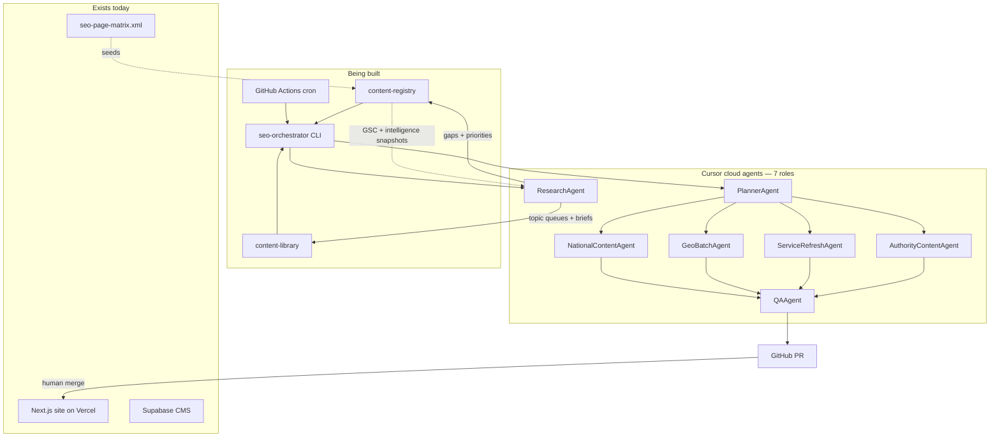

# Technical Overview — LCP Inbound Demand Engine

**Audience:** Engineering, product, technical leadership  
**Purpose:** Explain what we are building and how the agent system works — without sprint plans or timelines.

**Related docs:** [Agent SEO Automation](./AGENT_SEO_AUTOMATION.md) (full spec) · [Product Implementation Plan](./PRODUCT_IMPLEMENTATION_PLAN.md) (phased delivery)

---

## What this project is

Latest Craze Productions is turning **latestcrazeproductions.com** from a mostly static marketing site into a **search-driven inbound lead engine**.

There are two layers:

| Layer | What it is | Status today |
|-------|------------|--------------|
| **Website** | Next.js 15 app on Vercel — service pages, events, contact, CMS | **Live** (~29 routes) |
| **Automation** | Scheduled orchestrator + Cursor cloud agents that draft/update content and open PRs | **Not built yet** (spec only) |

Agents do **not** deploy to production directly. They open GitHub pull requests. A human reviews and merges. Vercel deploys from `main` as it does today.

---

## What exists in the repo today

| Component | Location | Notes |
|-----------|----------|-------|
| Marketing site | `src/app/` | Home, services, events, contact, about, one geo page (`phoenix-av-production`) |
| Static copy | `src/content/site-content.ts` | Service descriptions, hero, FAQs |
| CMS | `src/app/cms/` + Supabase | Live events, forms — **agents will not touch this in v1** |
| SEO URL matrix | `scripts/generate-seo-page-matrix.mjs` → `public/seo-page-matrix.xml` | ~1,110 planned URLs (national + geo) |
| Sitemap / schema | `src/app/api/sitemap-xml/`, `src/lib/structured-data.ts` | Existing SEO plumbing |

**Not in the repo yet:** `content-registry/`, `content-library/`, `agents/`, `scripts/seo-orchestrator/`, GitHub Actions cron workflows.

---

## What we are building (automation layer)

A **git-backed content operations system** that replaces a manual spreadsheet with:

1. **Content registry** — machine-readable queue of every URL, what track it belongs to, when it was last updated, and what to do next
2. **Content library** — reusable specs, templates, case-study manifests, blog topic lists
3. **SEO orchestrator** — TypeScript CLI that reads the registry, picks tasks for the current week/month/quarter, and dispatches work
4. **Cursor cloud agents** — specialized AI workers (one prompt + rules per role) that edit files in the repo
5. **Research layer** — monthly trend and gap analysis that refreshes topic queues and briefs before content is assigned
6. **QA gate** — deterministic checks + a lightweight review agent before anything becomes a PR
7. **GitHub Actions** — cron triggers (weekly / monthly / quarterly) that run the orchestrator in CI



---

## Two content tracks

Everything agents produce falls into one of two tracks. Both use the same orchestrator and PR gate.

| Track | Goal | Example outputs |
|-------|------|-----------------|
| **A — Demand capture** | Rank for buyers already searching | Service landing pages, geo pages, capture blogs, FAQ refreshes, internal links |
| **B — Authority & demand** | Build trust and convert visitors | Case studies, strategy blogs, planning tools, CTA audits, funnel metrics |

Track B is not “extra SEO.” It covers case studies (`/work/[slug]`), executive strategy content, downloadable resources (`/resources/[slug]`), and monthly reporting against revenue targets in `metrics.json`.

---

## The seven agents

These are **not** long-running services or chatbots. Each agent is a **Cursor cloud agent invocation**: a prompt file + rules file sent to the Cursor API with a specific task and file scope. The orchestrator calls `Agent.prompt()` (or `Agent.create()` for bulk builds) via `@cursor/sdk`.

| Agent | Track | What it does |
|-------|-------|--------------|
| **ResearchAgent** | A + B | **Upstream intelligence.** Scans keyword gaps, trending topics, competitor coverage, and weak pages. Updates topic queues and writes per-topic briefs so content agents write about what matters — not a fixed rotation list. |
| **PlannerAgent** | A + B | Reads registry + rotation + metrics + **research output**; outputs an ordered task list (max 5 per run). Also runs deterministic scripts: internal-link passes, CTA audits, monthly funnel gap reports. |
| **NationalContentAgent** | A + B | National capture blogs, executive strategy blogs, quarterly refresh of `/nationwide-event-production`. Uses research briefs when assigned a topic. |
| **GeoBatchAgent** | A | Per-city content: local blogs, local proof lines on service pages, links back to nationwide hub. Uses geo-specific gap data from research. |
| **ServiceRefreshAgent** | A + B | Keeps service pages fresh: gallery swaps, FAQ updates, `dateModified` touches, hero/CTA improvements on underperforming landings. |
| **AuthorityContentAgent** | B | Case studies, venue guides, conference recaps, planning tools/checklists. Publishes to `/work/`, `/resources/`, extends `/featured-venues`. |
| **QAAgent** | A + B | Gate before PR: deterministic checks (title rules, word counts, CTA presence, cannibalization) + one LLM pass on the diff. Failed QA = no PR. |

### ResearchAgent (detail)

Content quality depends on writing the **right** thing, not just writing well. ResearchAgent runs **before** content agents on the monthly cadence (and on-demand during phase builds). It does **not** publish pages — it improves what gets assigned.

**Inputs — free intelligence stack (v1):**

Semrush is **not** a required dependency. v1 uses several free sources working together:

| Source | Role | Committed to repo (v1) |
|--------|------|------------------------|
| **Google Search Console** | Primary source of truth — queries, impressions, clicks, position, CTR | `content-registry/gsc-snapshot/` (monthly CSV export) |
| **Google Keyword Planner** | Keyword discovery, rough monthly demand | Seeds `keywordTAM.json` |
| **Google Trends** | Seasonality, term comparison, regional interest (directional, not volume) | Notes in `research.json` |
| **Bing Webmaster Tools** | Secondary keyword ideas, SEO reports, backlink checks | Optional export in `content-registry/bing-snapshot/` |
| **SEO page matrix** | Planned URL/keyword coverage | `public/seo-page-matrix.xml` → `pages.jsonl` |
| **Sales team input** | Buyer questions, objections, deal themes | `content-registry/sales-intel.json` |
| **Manual competitor review** | Page-type gaps, positioning, SERP patterns | `content-registry/competitor-scan.json` |
| **GA4** | Traffic, landing pages, engagement | Feeds `metrics.json` actuals (manual v1) |
| **CRM / forms** | Lead quality, pipeline, revenue | Feeds `metrics.json` actuals (manual v1) |

**v2 upgrades:** GSC API auto-pull, GA4 API, CRM integration — reduces manual CSV commits.

**What each source replaces from a paid SEO tool:**

| Paid-tool function | Free replacement |
|--------------------|------------------|
| Keyword performance | GSC queries + impressions |
| Ranking movement | GSC average position |
| Low-CTR opportunities | GSC impressions + CTR |
| Page opportunity detection | GSC page/query reports |
| Search validation after publish | GSC impressions for target terms |
| Keyword discovery (pre-rank) | Keyword Planner + Bing WMT + matrix |
| Seasonality / term comparison | Google Trends |
| Competitor gap research | Manual SERP review → `competitor-scan.json` |

**Outputs:**

| Artifact | Purpose |
|----------|---------|
| `content-registry/research.json` | Prioritized gaps, trending topics, competitor notes, last scan date |
| `content-library/topics/*.json` | Updated topic queues ranked by opportunity score |
| `content-library/research/briefs/{slug}.md` | Per-topic brief: search intent, angle, outline, internal links, anti-cannibalization notes |
| Registry suggestions | New rows or `nextAction` updates in `pages.jsonl` (human-reviewed in PR) |

**Example tasks:** `research.keyword_gap_scan`, `research.trending_topics`, `research.competitor_audit`, `research.topic_brief`

PlannerAgent attaches the matching brief to each blog/case-study task. NationalContentAgent and AuthorityContentAgent must follow the brief or explain why they deviated in the PR description.

### What each agent actually edits

Agents are constrained to git content paths:

- `src/app/**/page.tsx` — new/updated landing pages, blogs, case studies, resources
- `src/content/site-content.ts` — national service copy blocks
- `content-library/` — specs, templates, manifests, **research briefs**
- `content-registry/` — automation state (last updated, next action)

ResearchAgent additionally writes `content-registry/research.json` and `content-library/research/briefs/`. It does **not** edit `src/app/` page files directly.

They **must not** change Supabase migrations, env files, or CMS auth without explicit human approval.

### Prompt files (planned layout)

```
agents/
├── prompts/
│   ├── research.md              # gap scan, trending topics, topic briefs
│   ├── planner.md
│   ├── national-content.md
│   ├── geo-batch.md
│   ├── service-refresh.md
│   ├── authority-content.md
│   └── qa-gate.md
└── rules/
    └── seo-master-plan.mdc    # shared constraints for all agents
```

---

## How a run works

### Monthly (research first)

1. **ResearchAgent** runs at the start of the monthly cadence.
2. Ingests GSC snapshots, competitor scan, matrix coverage, and `keywordTAM.json`; compares against `pages.jsonl`.
3. Produces gap report, re-ranks topic queues, writes briefs for top-priority topics.
4. Opens a **research PR** (topics + briefs only — no new pages). Human approves research direction.

### Weekly / monthly / quarterly (content)

1. **GitHub Actions** fires the matching workflow (e.g. `seo-weekly.yml` Monday 9am PT).
2. **Orchestrator** loads registry, rotation, metrics, and **`research.json`**.
3. **PlannerAgent** maps cadence + rotation + research priorities → up to 5 `Task` objects (each blog/case-study task includes a brief path when available).
4. **Dispatch** calls Cursor SDK for each task with the matching agent prompt.
5. Cloud agent edits files on a branch; **`autoCreatePr: true`** opens a PR.
6. **QA checks** run against the branch (deterministic + QAAgent).
7. Registry files update on the same PR (last updated, rotation week advances).
8. **Human** reviews PR → merge → Vercel deploys.

Monthly and quarterly runs add Track B work: case studies, CTA audits, funnel gap reports, tool-page refreshes.

---

## Content registry (the “brain”)

The registry replaces a spreadsheet. **`pages.jsonl`** is one JSON object per line — the work queue.

```json
{"url":"/services/led-walls","layer":"national","type":"service","track":"A","nextAction":"faq_refresh","tier":"monthly","phase":1}
{"url":"/scottsdale-az/services/led-walls","layer":"geo","siteId":"scottsdale-az","type":"service","track":"A","nextAction":"local_proof_line","tier":"monthly","phase":2}
{"url":"/work/night-of-hope","layer":"national","type":"case_study","track":"B","nextAction":"refresh_gallery","tier":"quarterly","phase":1}
```

Supporting files:

| File | Role |
|------|------|
| `config.json` | Current phase, cadence anchors |
| `sites.json` | Geo site manifests (city, slug, contact) |
| `rotation.json` | Which week (1–4) and which geo batch is active |
| `metrics.json` | Funnel targets vs actuals (Track B) |
| `conversion.json` | CTA patterns and page scores |
| `keywordTAM.json` | Head-term targets — seeded from Keyword Planner + matrix; refined with GSC |
| `research.json` | Trending topics, keyword gaps, competitor notes, research run metadata |
| `competitor-scan.json` | Manual SERP review: page types, positioning gaps, SERP patterns per keyword |
| `sales-intel.json` | Buyer questions and objections from sales team |
| `gsc-snapshot/` | Committed GSC exports (queries, pages, performance) |
| `bing-snapshot/` | Optional Bing Webmaster Tools exports |

The matrix script seeds planned URLs; the orchestrator merges in live sitemap URLs.

---

## Website routes agents will add

| Route pattern | Content type | Track |
|---------------|--------------|-------|
| `/nationwide-event-production` | National hub | A |
| `/markets` | Markets index | A |
| `/services/*`, `/{city}/services/*` | Service landings | A |
| `/blog/[slug]` | Capture + strategy blogs | A + B |
| `/work/[slug]` | Case studies | B |
| `/resources/[slug]` | Checklists, planning tools | B |
| `/{city}-*` | Geo landing pages | A |

Phase gates in the registry control **when** geo expansion is allowed (national foundation first).

---

## Key design constraints

| Constraint | Why |
|------------|-----|
| **PR-only publishing** | No auto-merge; marketing reviews every change |
| **Max 5 tasks per run** | Keeps PRs reviewable |
| **Deterministic QA first** | Cheap, repeatable rules before LLM review |
| **National vs geo keyword rules** | National titles have no city; geo titles must include city — prevents cannibalization |
| **Content mix** | ~55% service / 15% capture blog / 15% strategy / 15% authority assets |
| **Research before assign** | Monthly gap scan refreshes topic queues; content agents write from briefs |
| **Cursor SDK cloud mode** | Agents run in Cursor cloud against the GitHub repo, not locally |

---

## What “agent-driven” does and does not mean

**Does mean:**
- Recurring content work (blogs, refreshes, case studies, link passes) is **scheduled and executed by AI** with human review
- The orchestrator decides *what* to work on from registry state
- Each agent role has a narrow, documented responsibility

**Does not mean:**
- Autonomous deployment or auto-merge
- Agents managing the CMS, database, or infrastructure
- A single general-purpose chatbot running the site
- Replacing human judgment on brand, pricing, or client approvals

---

## Dependencies to run automation

### Runtime (required)

| Requirement | Purpose |
|-------------|---------|
| `CURSOR_API_KEY` | GitHub Actions secret — authenticates Cursor SDK |
| `@cursor/sdk` | Orchestrator dependency for `Agent.prompt()` |
| Node.js in CI | Runs orchestrator CLI |
| Google Chrome | Only needed for local PDF export of docs — not for agents |

### Intelligence (v1 — free stack, not required to boot)

Semrush is **not** a required dependency for v1. The system uses a free intelligence stack: **Google Search Console, GA4, Google Keyword Planner, Google Trends, Bing Webmaster Tools**, the existing SEO page matrix, sales input, and manual competitor review. Paid SEO tooling (Semrush, Ahrefs, Moz, etc.) may be added later when organic visibility and lead activity create enough volume to justify deeper keyword, competitor, and backlink intelligence.

| Source | Required for automation to run? | Required for research quality? |
|--------|--------------------------------|--------------------------------|
| GSC property access | No | **Yes** (once pages are live) |
| GA4 property access | No | Recommended |
| Google Keyword Planner | No | Yes (initial `keywordTAM.json` seed) |
| Google Trends | No | Recommended |
| Bing Webmaster Tools | No | Optional |
| Manual competitor review | No | **Yes** |
| Sales input | No | Recommended |

---

## How to measure success (without Semrush)

Do not measure the program by “Semrush keywords.” Measure by a funnel:

| Level | Question | Key metrics | Source |
|-------|----------|-------------|--------|
| **1 — Coverage** | Is the machine producing the planned footprint? | Pages created/refreshed, indexed URLs, services/cities covered, authority assets published | Registry + GSC index coverage |
| **2 — Visibility** | Is Google testing our pages? | Impressions, queries with impressions, average position, CTR, pages in positions 8–30, high-impression/low-CTR pages | GSC |
| **3 — Traffic** | Are impressions becoming visits? | Organic sessions, landing page traffic, engagement rate | GA4 |
| **4 — Leads** | Are visits becoming inquiries? | Form submits, quote requests, phone clicks, leads by landing page/market | GA4 + forms/CRM |
| **5 — Sales quality** | Is this producing business? | Accepted leads, opportunities, pipeline, closed-won revenue, close rate | CRM + sales review |

**Early success signal:** impressions for the right terms — not leads yet.

### Monthly dashboard (suggested)

| Category | Metric | Source |
|----------|--------|--------|
| Coverage | Pages created/refreshed | Content registry |
| Indexing | Indexed priority URLs | GSC |
| Visibility | Impressions | GSC |
| Discovery | Queries with impressions | GSC |
| Ranking | Queries in positions 8–30 | GSC |
| CTR | High impressions / low CTR pages | GSC |
| Traffic | Organic sessions | GA4 |
| Conversion | Form submits / quote requests | GA4 + CRM |
| Sales | Opportunities / pipeline | CRM |
| Quality | Sales-accepted leads | Sales review |

### When a paid SEO subscription is justified

| Trigger | Example |
|---------|---------|
| GSC shows traction but prioritization is unclear | 1,000+ monthly impressions, 50+ queries, pages in positions 8–30 — need better gap intelligence |
| Geo expansion at scale | Moving from 10 → 50–100 cities; need market-level demand signals |
| Organic leads appearing, attribution unclear | Leadership asks “where should we invest next?” |
| Pipeline exceeds subscription cost | Even one qualified organic opportunity/month with meaningful deal potential |

Business proof always comes from **GSC + GA4 + CRM** — paid tools help prioritize the *next* pages, not replace outcome tracking.

---

## Where to go deeper

| Question | Document |
|----------|----------|
| Sprint execution guide | [BUILD_PLAN.md](./BUILD_PLAN.md) |
| Full agent specs, task types, SDK examples | [AGENT_SEO_AUTOMATION.md](./AGENT_SEO_AUTOMATION.md) |
| Phased rollout, sprints, acceptance criteria | [PRODUCT_IMPLEMENTATION_PLAN.md](./PRODUCT_IMPLEMENTATION_PLAN.md) |
| Business case and leadership narrative | [CEO Executive Summary](./CEO_EXECUTIVE_SUMMARY.md) |
| Baseline SEO audit | [SEO_ANALYSIS.md](./SEO_ANALYSIS.md) |
| Ops runbook | [SEO_OPS_RUNBOOK.md](./SEO_OPS_RUNBOOK.md) |

---

## Plan FAQ

Answers to common review questions before implementation.

### Where is national vs geo keyword strategy enforced?

| Layer | Location | Status |
|-------|----------|--------|
| URL matrix | [`scripts/generate-seo-page-matrix.mjs`](../scripts/generate-seo-page-matrix.mjs) — `layer: national` vs `layer: geo`, title patterns | Live |
| Example geo page | [`src/app/phoenix-av-production/page.tsx`](../src/app/phoenix-av-production/page.tsx) — city in title | Live |
| Agent rules | [`agents/rules/seo-master-plan.mdc`](../agents/rules/seo-master-plan.mdc) | Committed |
| Automated QA | [`scripts/seo-orchestrator/src/qa-checks.ts`](../scripts/seo-orchestrator/src/qa-checks.ts) | Committed |

**Rule:** National pages must not include city names in titles (Phoenix HQ address in body only). Geo pages must include the target city in the title. Prevents two pages competing for the same query (*cannibalization*).

### Why 55 / 15 / 15 / 15 content mix?

From [SEO Improvement Plan](./SEO_IMPROVEMENT_PLAN.md): pure page volume scores high on SEO operations but low on conversion and authority.

| Share | Role |
|-------|------|
| 55% service | Demand capture — rank for buyers searching now |
| 15% capture blogs | Support service pages, long-tail queries |
| 15% strategy blogs | Executive trust — partner, not AV vendor |
| 15% authority | Case studies, tools — convert skeptical buyers |

Enforced in `scheduler.ts` over a rolling 4-week window. Adjustable after 90 days of GSC + lead data.

### Cloud vs local Cursor SDK

| | Cloud (production) | Local (dev only) |
|--|---------------------|------------------|
| Runs on | Cursor-hosted VM | Your machine / CI runner |
| Repo | Clones from GitHub | Local `cwd` |
| Output | Auto-creates PR | No PR unless wired manually |
| CI | **Required** for cron | Wrong default if `cloud` omitted |

### Does “agent-driven” mean AI writes content?

**Yes, with a human gate.** Agents draft/edit files in the repo and open PRs. Marketing reviews and merges. Vercel deploys from `main`. Agents do not auto-merge or touch Supabase in v1.

### How does the orchestrator decide what to work on?

1. Load `pages.jsonl`, `rotation.json`, `research.json`, `metrics.json`, `config.json`
2. Filter by cadence (weekly/monthly/quarterly) and phase gate (no geo until national hub exists)
3. Planner rules: max 5 tasks, prefer research priorities, enforce content mix, oldest `lastUpdated` first
4. Map task type → agent (Research, National, Geo, ServiceRefresh, Authority, QA)
5. QA gate → PR or fail; update registry on success

See [`scripts/seo-orchestrator/src/scheduler.ts`](../scripts/seo-orchestrator/src/scheduler.ts).
